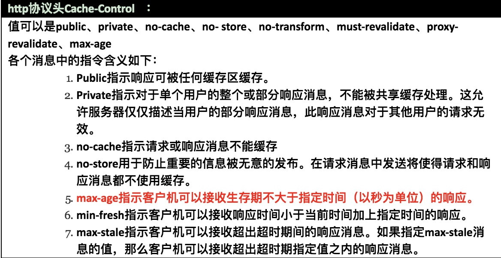
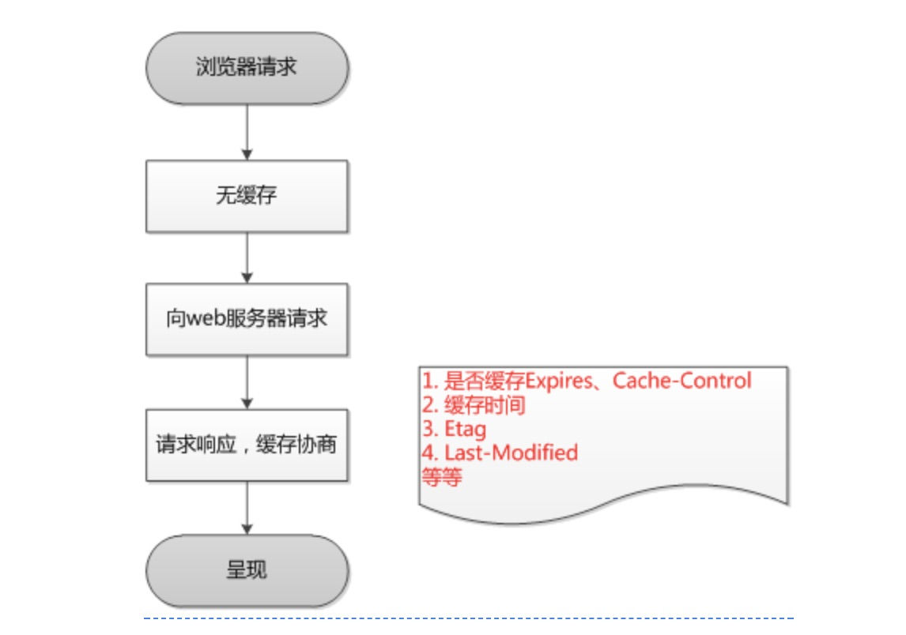
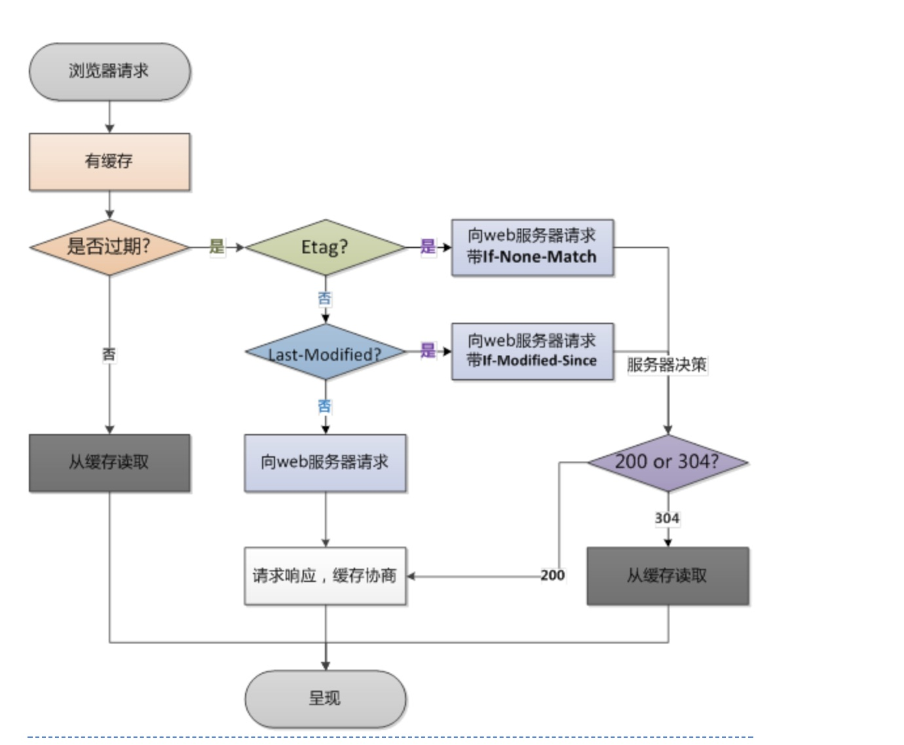

# Web缓存机制

## 协议缓存

## Last-Modified/If-Modified-Since

Last-Modified/If-Modified-Since要配合Cache-Control使用。

l Last-Modified：标示这个响应资源的最后修改时间。web服务器在响应请求时，告诉浏览器资源的最后修改时间。

l If-Modified-Since：当资源过期时（使用Cache-Control标识的max-age），发现资源具有Last-Modified声明，则再次向web服务器请求时带上头 **If-Modified-Since**，表示请求时间。**web**服务器收到请求后发现有头**If-Modified-Since** 则与被请求资源的最后修改时间进行比对。若最后修改时间较新，说明资源又被改动过，则响应整片资源内容（写在响应消息包体内），HTTP 200；若最后修改时间较旧，说明资源无新修改，则响应HTTP 304 (无需包体，节省浏览)，告知浏览器继续使用所保存的cache。

## Etag/If-None-Match

Etag/If-None-Match也要配合Cache-Control使用。

l Etag：web服务器响应请求时，告诉浏览器当前资源在服务器的唯一标识（生成规则由服务器决定）。*Apache*中，*ETag*的值，默认是对文件的索引节（*INode*），大小（*Size*）和最后修改时间（*MTime*）进行*Hash*后得到的。

l If-None-Match：当资源过期时（使用Cache-Control标识的max-age），发现资源具有Etage声明，则再次向web服务器请求时带上头If-None-Match （**Etag**的值）。**web**服务器收到请求后发现有头**If-None-Match** 则与被请求资源的相应校验串进行比对，决定返回**200**或**304**。

## 既生Last-Modified何生Etag？

你可能会觉得使用Last-Modified已经足以让浏览器知道本地的缓存副本是否足够新，为什么还需要Etag（实体标识）呢？HTTP1.1中Etag的出现主要是为了解决几个Last-Modified比较难解决的问题：

l Last-Modified标注的最后修改只能精确到秒级，如果某些文件在1秒钟以内，被修改多次的话，它将不能准确标注文件的修改时间

l 如果某些文件会被定期生成，当有时内容并没有任何变化，但Last-Modified却改变了，导致文件没法使用缓存

l 有可能存在服务器没有准确获取文件修改时间，或者与代理服务器时间不一致等情形

Etag是服务器自动生成或者由开发者生成的对应资源在服务器端的唯一标识符，能够更加准确的控制缓存。**Last-Modified**与**ETag**是可以一起使用的，服务器会优先验证**ETag**，一致的情况下，才会继续比对**Last-Modified**，最后才决定是否返回**304**。

浏览器第一次请求：

浏览器再次请求：

感觉这个图有点不对，ETag可以和Last-Modified结合起来一起使用，上图只在ETag否的时候才去判断Last-Modified.

在ETag存在的时候，web服务器优先判断if-none-match，如果一致，再去判断协议头是否有last-modified,如果没有的话，返回304，如果有，服务器去判断if-modified-since，如果符合，返回304，不符合就返回200
